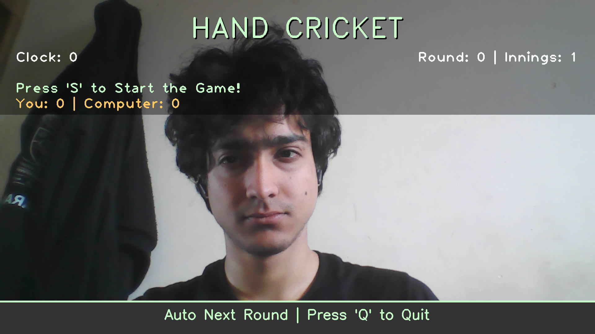
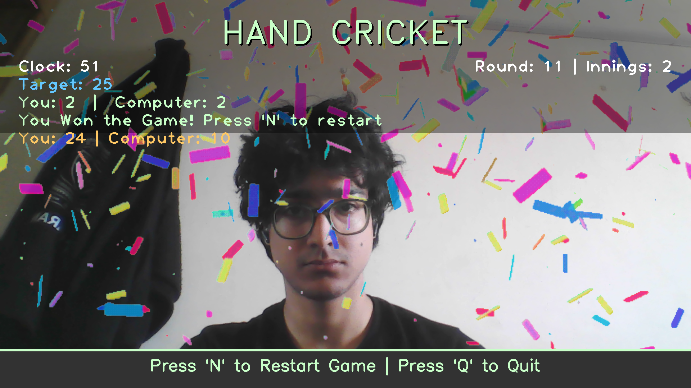
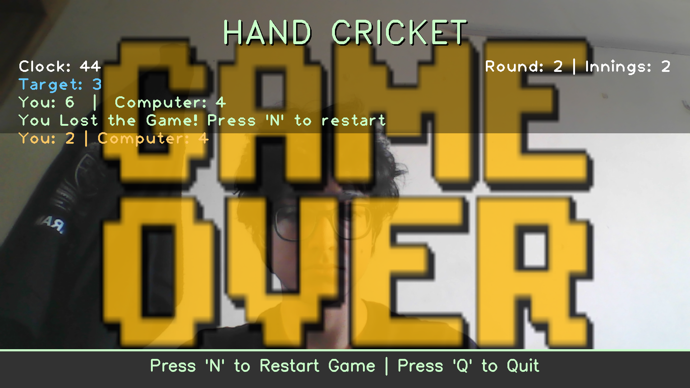

# 🏏 Hand Cricket Game (OpenCV)

An interactive hand cricket game powered by computer vision and hand gesture recognition using MediaPipe. Play cricket against the computer using just your hand gestures!



## 🎮 Features

- **Real-time Hand Detection**: Uses MediaPipe's hand landmarker for accurate finger counting
- **Gesture-Based Gameplay**: Show 0-5 fingers to score runs (0 fingers = 1 run, 5 fingers = 6 runs)
- **Two Innings System**: Complete cricket experience with batting and bowling turns
- **Sound Effects**: Immersive audio for runs, outs, wins, and losses
- **Victory Animations**: Celebrate wins and commiserate losses with animated GIFs
- **Fullscreen Mode**: Optimized for an immersive gaming experience
- **Auto Model Download**: Automatically downloads the required MediaPipe model on first run

## 📋 Prerequisites

- Python 3.8 or higher
- Webcam/Camera
- Working audio system (optional, for sound effects)

## 🚀 Installation

### Step 1: Clone the Repository

```bash
git clone https://github.com/Aerex0/opencv-hand-cricket.git
cd opencv-hand-cricket
```

### Step 2: Create Virtual Environment (Recommended)

```bash
python -m venv .venv

# On Windows
venv\Scripts\activate

# On macOS/Linux
source venv/bin/activate
```

### Step 3: Install Dependencies

#### Option A: Using requirements.txt (Recommended)

```bash
pip install -r requirements.txt
```

#### Option B: If you encounter conflicts

If you get dependency conflicts with requirements.txt, remove all installed packages and install manually:

```bash
# Uninstall everything first
pip freeze | xargs pip uninstall -y

# Install packages one by one
pip install mediapipe
pip install opencv-python
pip install imageio
pip install pygame
```

**Note:** `tkinter` comes pre-installed with Python. If you don't have it:
- **Ubuntu/Debian:** `sudo apt-get install python3-tk`
- **macOS/Windows:** Included with standard Python installation

## 📁 Project Structure

```
opencv-hand-cricket/
├── assets/                      # Game assets
│   ├── game-over-game.gif      # Loss animation
│   ├── Victory.gif             # Win animation
│   ├── lose.wav                # Loss sound
│   ├── out.wav                 # Out sound
│   ├── score.wav               # Background music
│   ├── tie.wav                 # Tie game sound
│   └── Win.wav                 # Victory sound
├── screenshots/                 # Game screenshots
│   ├── game-menu.png
│   ├── lose.png
│   └── win.png
├── main.py                     # Main game file
├── hand_landmarker.task        # MediaPipe model (auto-downloaded)
├── requirements.txt            # Python dependencies
└── readme.md                   # This file
```

## 🎯 How to Play

### Starting the Game

1. Run the game:
   ```bash
   python main.py
   ```

2. The game will automatically download the MediaPipe hand landmarker model on first run (if not present)

3. Press **'S'** to start the game

### Game Rules

1. **Finger Gestures:**
Use your Right Hand only
   - 1 finger = 1 run
   - 2 fingers = 2 runs
   - 3 fingers = 3 runs
   - 4 fingers = 4 runs
   - thumb = 6 runs

2. **Scoring:**
   - You bat first in Innings 1
   - Show your hand gesture when prompted (Clock 5-15)
   - If your gesture matches the computer's random choice = **OUT!**
   - If different = You score runs!

3. **Innings System:**
   - **Innings 1:** You bat, try to score as many runs as possible before getting out
   - **Innings 2:** Computer bats, tries to chase your target
   - First to get out in each innings ends that innings

4. **Winning:**
   - Score more runs than the computer to win!
   - If computer chases your target, you lose
   - Equal scores = Tie game

### Controls

| Key | Action |
|-----|--------|
| **S** | Start the game (from menu) |
| **N** | Restart game (after game over) |
| **Q** | Quit game |

### Game Timeline (Per Round)

- **Clock 0-5:** Get Ready phase
- **Clock 5-15:** Show your hand gesture
- **Clock 15:** Gesture captured and compared
- **Clock 15-25:** Result displayed with score
- **Clock 25:** Innings/game over processing
- **Clock 25+:** Auto-restart next round (if not game over)

## 🖼️ Screenshots

### Victory Screen


### Game Over Screen


## 🔧 Troubleshooting

### Camera Not Working
- Check if your webcam is connected and working
- Try running with administrator/sudo privileges
- Check if another application is using the camera

### MediaPipe Model Download Fails
- Check your internet connection
- Manually download from: https://storage.googleapis.com/mediapipe-models/hand_landmarker/hand_landmarker/float16/1/hand_landmarker.task
- Place it in the project root directory

### Hand Detection Issues
- Ensure good lighting conditions
- Keep your hand clearly visible to the camera
- Try adjusting your hand position and distance from camera
- Hand should be within 5-15 seconds of the "Show your hand" prompt

### Audio Not Playing
- Check if audio files exist in `assets/` folder
- Verify your system audio is not muted
- Game works without audio, but it's recommended for best experience

### Dependency Conflicts
- Use a fresh virtual environment
- Follow Option B installation method (manual package installation)
- Make sure you're using Python 3.8 or higher

## 🎨 Customization

### Changing Difficulty
Edit the computer's move generation in `main.py`:
```python
computer_move = random.choice([1, 2, 3, 4, 6])  # Current
computer_move = random.choice([1, 2, 3, 4, 5, 6])  # Include 5 for more variety
```

### Adjusting Detection Confidence
Modify the MediaPipe options in `main.py`:
```python
options = vision.HandLandmarkerOptions(
    base_options=base_options,
    num_hands=1,
    min_hand_detection_confidence=0.6,  # Lower = more sensitive
    min_hand_presence_confidence=0.6,
    min_tracking_confidence=0.6
)
```

### Custom Sounds/Animations
Replace files in the `assets/` folder with your own (keep the same filenames and formats)

## 🤝 Contributing

Contributions are welcome! Feel free to:
- Report bugs
- Suggest new features
- Submit pull requests
- Improve documentation

## 💡 Tips for Best Experience

1. **Lighting:** Play in a well-lit room for better hand detection
2. **Background:** Use a plain background behind your hand
3. **Hand Position:** Keep your hand at medium distance from the camera
4. **Gesture Timing:** Show your gesture clearly during the 5-15 second window
5. **Audio:** Use headphones or speakers for the full experience

## 🐛 Known Issues

- Thumb detection may occasionally be inaccurate depending on hand angle
- Animation playback speed depends on system performance
- Game requires manual restart after completion (press 'N')

## 📝 Version History

- **v1.0.0** - Initial release with full game functionality

## 👨‍💻 Author

**Suyash Ranjan (Aerex)**

- GitHub: [@Aerex0](https://github.com/Aerex0)
- Game: [OpenCV Hand Cricket](https://github.com/Aerex0/opencv-hand-cricket)

Created with ❤️ for cricket and gaming enthusiasts

## 🙏 Acknowledgments

- [MediaPipe](https://mediapipe.dev/) for hand tracking technology
- [OpenCV](https://opencv.org/) for computer vision capabilities
- [Pygame](https://www.pygame.org/) for audio management

---

**Enjoy playing Hand Cricket! 🏏🎮**
